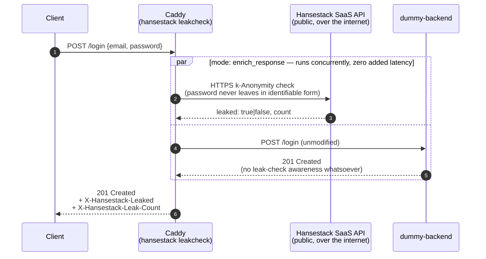

# leakcheck-caddy-demo

A minimal, runnable showcase of [`caddy-hansestack`](https://github.com/hansestack/caddy-hansestack) —
the Caddy v2 module that adds k-Anonymity password-leak checking to any
login endpoint **without touching a single line of backend code**.

## Decoupled Security

Traditional leak-checking (e.g. calling HaveIBeenPwned from your login
handler) means every backend that has a password field has to import a
client library, wire up an API key, and handle failure modes. This demo
shows a different model: the check lives entirely in the **reverse proxy
layer**, in front of the backend, configured purely via the `Caddyfile`.



By default (no `endpoint` set in the Caddyfile), Caddy calls the public
**Hansestack SaaS API** over the internet for every check — there is no
local leak-check server or sidecar in this demo. Swapping to a self-hosted
/ on-premise `endpoint` is possible but out of scope for this demo's
default configuration.

The backend is only ever called through Caddy — it never sees the leak
check happen, and (in `enrich_response` mode) it is never blocked by it
either. The two branches above run in parallel: the leak check never adds
latency to the login request.

The backend in this repo (`backend/`) is intentionally as dumb as
possible: it has **no database, no password hashing, no leak-check logic
whatsoever**. `POST /login` always returns `201 Created`. All of the
security-relevant behavior — checking the submitted password against a
k-anonymity leak corpus, without the plaintext password ever leaving the
process in identifiable form — happens in Caddy, before the request even
reaches the backend.

### Why `enrich_response` and not `block`?

The provided `Caddyfile` uses `mode enrich_response`: Caddy runs the leak
check **concurrently** with the backend request (zero added latency) and
tags the *response* with `X-Hansestack-Leaked` / `X-Hansestack-Leak-Count`
headers. It **never rejects a request** in this mode — the backend always
gets called, and the client always gets its `201 Created`, just with an
extra header attached.

This is the safe default for a customer-facing login flow: you get full
observability into leaked-password attempts without ever being able to
lock out a legitimate user due to an API hiccup.

The Caddyfile also sets `block_status 401`, which only takes effect if you
switch `mode` to `block`. In `block` mode, Caddy rejects the request
outright with that status code — but **only on a confirmed leak**, never
on a timeout or an unreachable API (fail-open is built into the plugin's
Go client, not something this Caddyfile has to compensate for). The demo's
frontend (`backend/index.html`) is written to handle **both** cases: it
reacts to `X-Hansestack-Leaked: true` on a `201` response (the
`enrich_response` default) and to a bare `401` (if you flip `mode` to
`block` yourself). Switching to `block` is a deliberate product decision,
not something this repo does for you silently.

## Components

| Service          | Image                                          | Purpose                                             |
|------------------|-------------------------------------------------|------------------------------------------------------|
| `caddy`          | `ghcr.io/hansestack/caddy-hansestack:latest`     | Reverse proxy + leak-check enforcement point, calling the public Hansestack SaaS API |
| `dummy-backend`  | built from `backend/`                            | Trivial Go app, oblivious to any of the above         |
| `victoriametrics`| `victoriametrics/victoria-metrics`               | Scrapes Caddy's `/metrics` (Prometheus format)        |
| `grafana`        | `grafana/grafana`                                | Dashboards for `caddy_http_*` and `hansestack_*` metrics |

There is no local leak-check server or sidecar in this stack — `caddy` talks
directly to the public Hansestack SaaS API over the internet, using only
`HANSESTACK_API_KEY` for authentication.

## Quick start

1. Get a Hansestack Leak-Check API key and copy the env template:

   ```bash
   cp .env.skel .env
   # then edit .env and set HANSESTACK_API_KEY
   ```

2. Start everything:

   ```bash
   docker-compose up --build
   ```

   A `Makefile` is also provided for convenience — see [Makefile targets](#makefile-targets)
   below (`make init && make up` does the same thing as steps 1–2).

3. Open the app:

   - **App**: [http://localhost](http://localhost) — try logging in with a
     known-leaked password (e.g. `password123`) and watch the response.
   - **Grafana**: [http://localhost:3000](http://localhost:3000) — no
     login required. Grafana is configured for anonymous, read-only
     (Viewer) access, and lands you directly on the "Hansestack Leak-Check
     Demo" dashboard — the only dashboard provisioned in this stack —
     organized into four rows:
     - **Traffic Overview** — Caddy's request rate/latency and the leak
       check's verdict/outcome trends over time.
     - **Verdicts** — color-coded stat tiles for Total Checks, Leaked
       (green unless >0, then red), and Not Leaked, totaled over whatever
       time range is currently selected in the dashboard's time picker
       (top right).
     - **Fail-Open Outcomes** — stat tiles for Checked (green — the API
       actually answered) versus each reason a check was skipped instead
       (Timeout, Rate Limited, Circuit Open, Skipped/Error, Canceled — all
       amber if >0, since these mean fail-open kicked in, not that
       anything is broken).
     - **Health** — Client Errors (red if >0 — signals a real
       misconfiguration, e.g. an invalid API key) and Total HTTP Requests.

     Hover over any stat tile for a tooltip with the full underlying
     PromQL metric/label it represents.

The Caddy admin API (and its `/metrics` endpoint) is additionally reachable
at `http://127.0.0.1:2019/metrics` directly from the host, for ad-hoc
`curl`ing — it is bound to `127.0.0.1` only, not exposed beyond the host.

Grafana's anonymous access is scoped to the `Viewer` role, so it can view
the provisioned dashboard but cannot edit it, create new ones, or reach
admin/server settings. This is a convenience for a local demo only — do
not expose this Grafana instance to the internet as configured. The
`admin` / `admin` credentials still work at Grafana's `/login` page if you
need to make changes.

## Makefile targets

| Target             | Description                                                        |
|---------------------|--------------------------------------------------------------------|
| `make init`         | Create `.env` from `.env.skel` if it doesn't exist yet             |
| `make up`           | `init` + start the full stack (rebuilds images)                    |
| `make down`         | Stop the stack                                                     |
| `make restart`      | `down` + `up`                                                      |
| `make reset`        | Stop the stack, wipe all volumes, and start fresh                  |
| `make logs`         | Tail logs from all services                                        |
| `make ps`           | Show the status of all compose services                            |
| `make build`        | Build the dummy backend binary locally (outside Docker)            |
| `make test-login`   | Send a sample `POST /login` through Caddy and print the response   |
| `make open`         | Open the app and Grafana in your default browser                   |
| `make clean`        | Remove local build artifacts (`bin/`)                               |

Run `make help` at any time to see this list with descriptions.

## Configuration reference

See [`Caddyfile`](./Caddyfile) for the full directive and
[`.env.skel`](./.env.skel) for the environment variables it reads
(`HANSESTACK_API_KEY`, plus optional `HANSESTACK_TIMEOUT`, circuit
breaker tuning, and `HANSESTACK_MAX_IDLE_CONNS`). None of these are
required beyond `HANSESTACK_API_KEY` — the rest have sane defaults baked
into the Caddyfile itself.

The Caddyfile has no `endpoint` directive set, so the `hansestack
leakcheck` handler defaults to the public Hansestack SaaS API — there is no
local leak-check server to run or configure. `max_idle_conns` (default
`200`, overridable via `HANSESTACK_MAX_IDLE_CONNS`) caps how many idle
keep-alive connections the underlying HTTP client pools to that SaaS API,
which bounds TCP socket growth under a login traffic spike instead of
opening a fresh connection per concurrent leak check. As with the other
tuning knobs (`timeout`, `circuit_breaker_threshold`,
`circuit_breaker_cooldown`), it is only worth touching if you have an
explicit reason to — the default of `200` is sane for this demo. Per this
plugin's own guidance, `mode enrich_response` remains the default here:
it adds full observability into leaked-password attempts without ever
being able to reject a login, which is why nothing in this repo needs to
change to safely enable leak-checking against your real login flow.

## Repository layout

```
.
├── Caddyfile                          # the security layer's entire config
├── docker-compose.yml
├── .env.skel
├── backend/
│   ├── main.go                        # trivial Go server, no leak-check awareness
│   ├── index.html                     # vanilla JS/CSS login form
│   └── Dockerfile
├── metrics/
│   └── scrape.yml                     # VictoriaMetrics scrape config for caddy:2019
└── grafana/
    ├── provisioning/
    │   ├── datasources/ds.yml         # auto-adds VictoriaMetrics as a datasource
    │   └── dashboards/dashboards.yml  # auto-loads grafana/dashboards/*.json
    └── dashboards/
        └── hansestack.json            # placeholder dashboard
```

